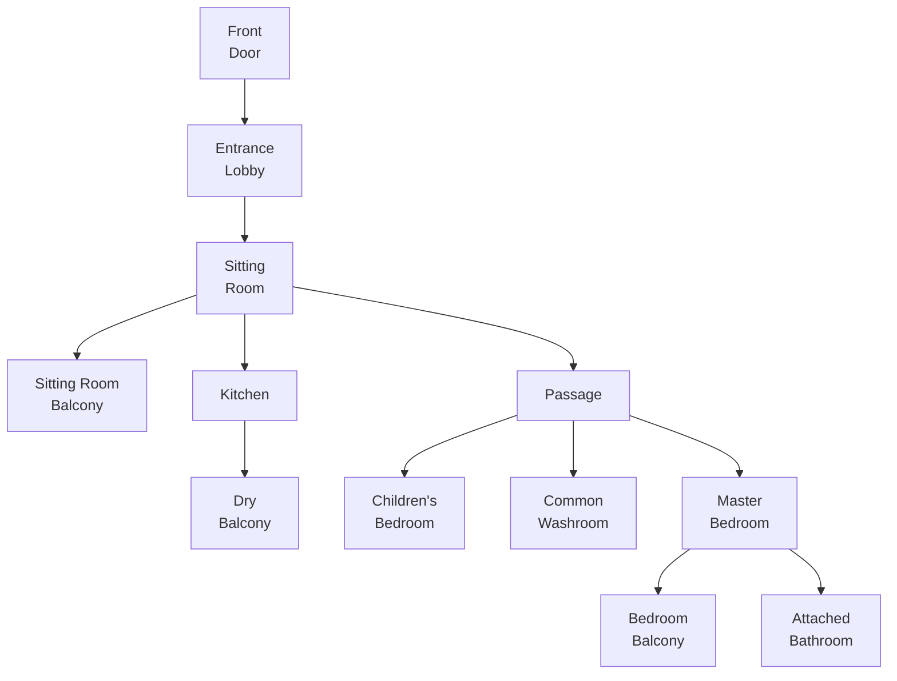
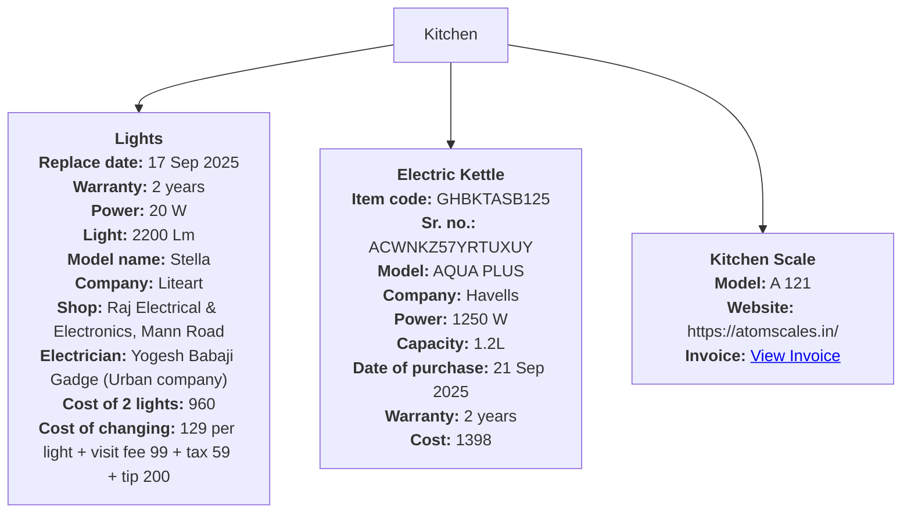
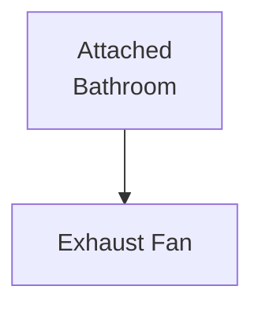
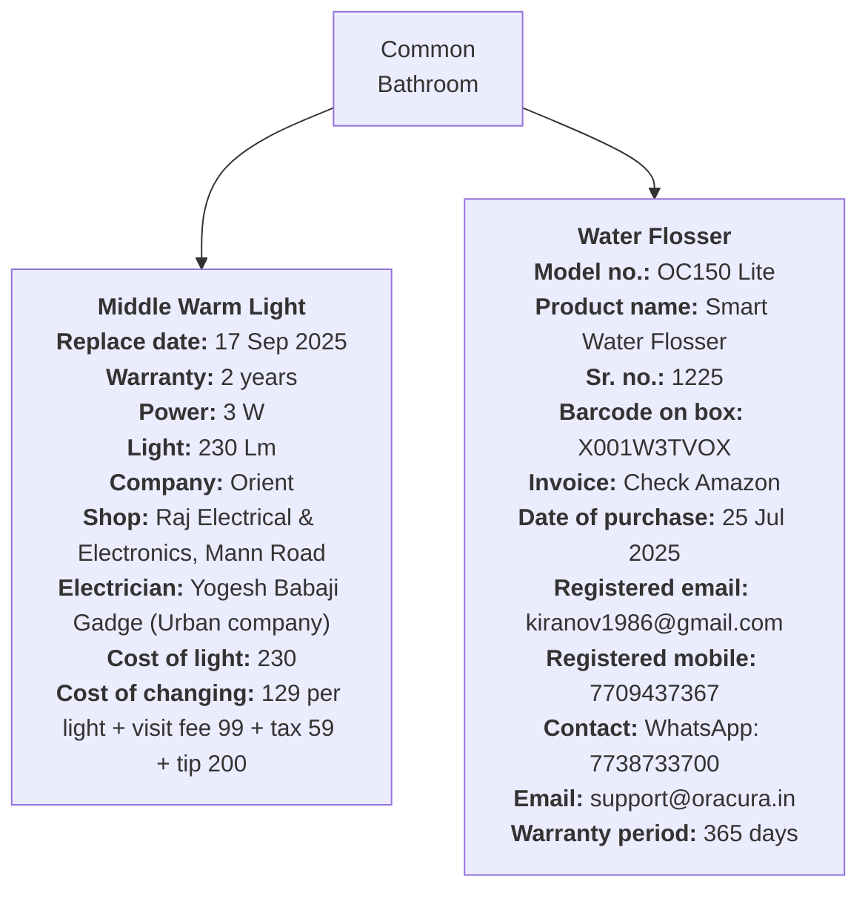
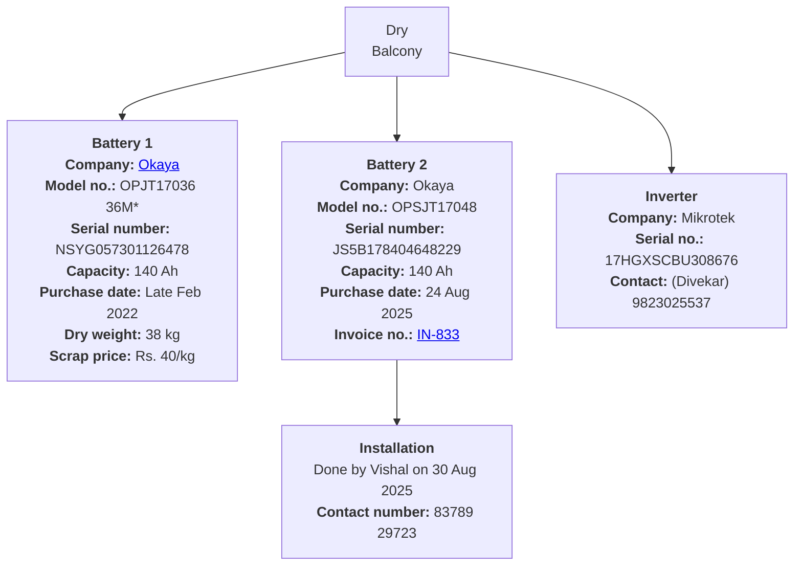
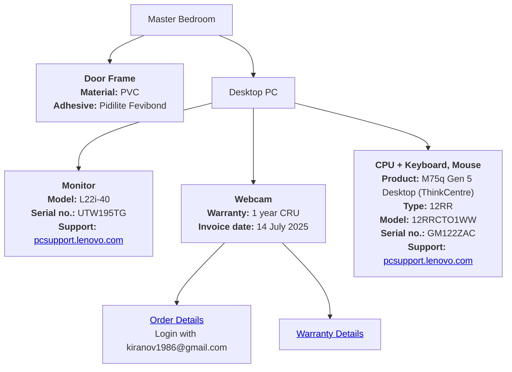

# Rooms

## House Map

```mermaid
graph TD
    front_door["Front<br/>Door"]
    entrance_lobby["Entrance<br/>Lobby"]
    sitting_room["Sitting<br/>Room"]
    sitting_room_balcony["Sitting Room<br/>Balcony"]
    kitchen["Kitchen"]
    dry_balcony["Dry<br/>Balcony"]
    childrens_bedroom["Children's<br/>Bedroom"]
    passage["Passage"]
    common_washroom["Common<br/>Washroom"]
    master_bedroom["Master<br/>Bedroom"]
    bedroom_balcony["Bedroom<br/>Balcony"]
    attached_bathroom["Attached<br/>Bathroom"]

    front_door --> entrance_lobby
    entrance_lobby --> sitting_room
    sitting_room --> sitting_room_balcony
    sitting_room --> kitchen
    sitting_room --> passage
    kitchen --> dry_balcony
    passage --> childrens_bedroom
    passage --> master_bedroom
    passage --> common_washroom
    master_bedroom --> bedroom_balcony
    master_bedroom --> attached_bathroom

```

## Kitchen

```mermaid
graph TD
    kitchen[Kitchen]
    
    kitchen --> lights_info["<b>Lights</b><br/><b>Replace date:</b> 17 Sep 2025<br/><b>Warranty:</b> 2 years<br/><b>Power:</b> 20 W<br/><b>Light:</b> 2200 Lm<br/><b>Model name:</b> Stella<br/><b>Company:</b> Liteart<br/><b>Shop:</b> Raj Electrical & Electronics, Mann Road<br/><b>Electrician:</b> Yogesh Babaji Gadge (Urban company)<br/><b>Cost of 2 lights:</b> 960<br/><b>Cost of changing:</b> 129 per light + visit fee 99 + tax 59 + tip 200"]
    
    kitchen --> electric_kettle["<b>Electric Kettle</b><br/><b>Item code:</b> GHBKTASB125<br/><b>Sr. no.:</b> ACWNKZ57YRTUXUY<br/><b>Model:</b> AQUA PLUS<br/><b>Company:</b> Havells<br/><b>Power:</b> 1250 W<br/><b>Capacity:</b> 1.2L<br/><b>Date of purchase:</b> 21 Sep 2025<br/><b>Warranty:</b> 2 years<br/><b>Cost:</b> 1398"]
    
    kitchen --> kitchen_scale["<b>Kitchen Scale</b><br/><b>Model:</b> A 121<br/><b>Website:</b> https://atomscales.in/<br/><b>Invoice:</b> <a href='https://drive.google.com/file/d/12774JM2mrldhrkIQHJ3t-M-lcnAzqGIc/view?usp=drive_link'>View Invoice</a>"]

```

## Attached Bathroom

```mermaid
graph TD
    attached_bathroom["Attached<br/>Bathroom"]
    exhaust_fan["Exhaust Fan"]
    
    attached_bathroom --> exhaust_fan

```

## Common Bathroom

```mermaid
graph TD
    common_bathroom["Common<br/>Bathroom"]
    
    common_bathroom --> lights_info["<b>Middle Warm Light</b><br/><b>Replace date:</b> 17 Sep 2025<br/><b>Warranty:</b> 2 years<br/><b>Power:</b> 3 W<br/><b>Light:</b> 230 Lm<br/><b>Company:</b> Orient<br/><b>Shop:</b> Raj Electrical & Electronics, Mann Road<br/><b>Electrician:</b> Yogesh Babaji Gadge (Urban company)<br/><b>Cost of light:</b> 230<br/><b>Cost of changing:</b> 129 per light + visit fee 99 + tax 59 + tip 200"]
    
    common_bathroom --> smart_water_flosser["<b>Water Flosser</b><br/><b>Model no.:</b> OC150 Lite<br/><b>Product name:</b> Smart Water Flosser<br/><b>Sr. no.:</b> 1225<br/><b>Barcode on box:</b> X001W3TVOX<br/><b>Invoice:</b> Check Amazon<br/><b>Date of purchase:</b> 25 Jul 2025<br/><b>Registered email:</b> kiranov1986@gmail.com<br/><b>Registered mobile:</b> 7709437367<br/><b>Contact:</b> WhatsApp: 7738733700<br/><b>Email:</b> support@oracura.in<br/><b>Warranty period:</b> 365 days"]

```

## Dry Balcony

```mermaid
graph TD
    dry_balcony["Dry<br/>Balcony"]
    
    dry_balcony --> battery1["<b>Battery 1</b><br/><b>Company:</b> <a href='https://www.okaya.in/'>Okaya</a><br/><b>Model no.:</b> OPJT17036 36M*<br/><b>Serial number:</b> NSYG057301126478<br/><b>Capacity:</b> 140 Ah<br/><b>Purchase date:</b> Late Feb 2022<br/><b>Dry weight:</b> 38 kg<br/><b>Scrap price:</b> Rs. 40/kg"]
    
    dry_balcony --> battery2["<b>Battery 2</b><br/><b>Company:</b> Okaya<br/><b>Model no.:</b> OPSJT17048<br/><b>Serial number:</b> JS5B178404648229<br/><b>Capacity:</b> 140 Ah<br/><b>Purchase date:</b> 24 Aug 2025<br/><b>Invoice no.:</b> <a href='https://drive.google.com/drive/folders/1KSsZaKbGHmp8fhcXDCfaVpSL3BhorRY2?usp=drive_link'>IN-833</a>"]
    
    dry_balcony --> inverter["<b>Inverter</b><br/><b>Company:</b> Mikrotek<br/><b>Serial no.:</b> 17HGXSCBU308676<br/><b>Contact:</b> (Divekar) 9823025537"]
    
    battery2 --> battery2_installation["<b>Installation</b><br/>Done by Vishal on 30 Aug 2025<br/><b>Contact number:</b> 83789 29723"]
    

```

## Master Bedroom

```mermaid
graph TD
    bedroom["Master Bedroom"]
    
    bedroom --> door_frame["<b>Door Frame</b><br/><b>Material:</b> PVC<br/><b>Adhesive:</b> Pidilite Fevibond"]
    
    bedroom --> desktop_pc["Desktop PC"]
    
    desktop_pc --> monitor["<b>Monitor</b><br/><b>Model:</b> L22i-40<br/><b>Serial no.:</b> UTW195TG<br/><b>Support:</b> <a href='https://pcsupport.lenovo.com/in/en'>pcsupport.lenovo.com</a>"]
    
    desktop_pc --> webcam["<b>Webcam</b><br/><b>Warranty:</b> 1 year CRU<br/><b>Invoice date:</b> 14 July 2025"]
    
    desktop_pc --> cpu["<b>CPU + Keyboard, Mouse</b><br/><b>Product:</b> M75q Gen 5 Desktop (ThinkCentre)<br/><b>Type:</b> 12RR<br/><b>Model:</b> 12RRCTO1WW<br/><b>Serial no.:</b> GM122ZAC<br/><b>Support:</b> <a href='https://pcsupport.lenovo.com/in/en'>pcsupport.lenovo.com</a>"]
    
    webcam --> webcam_order["<a href='https://account.lenovo.com/in/en/account/login/index.html'>Order Details</a><br/>Login with kiranov1986@gmail.com"]
    
    webcam --> webcam_warranty["<a href='https://support.lenovo.com/in/en/accessories/lenovo_510_fhd_webcam'>Warranty Details</a>"]
    

```
